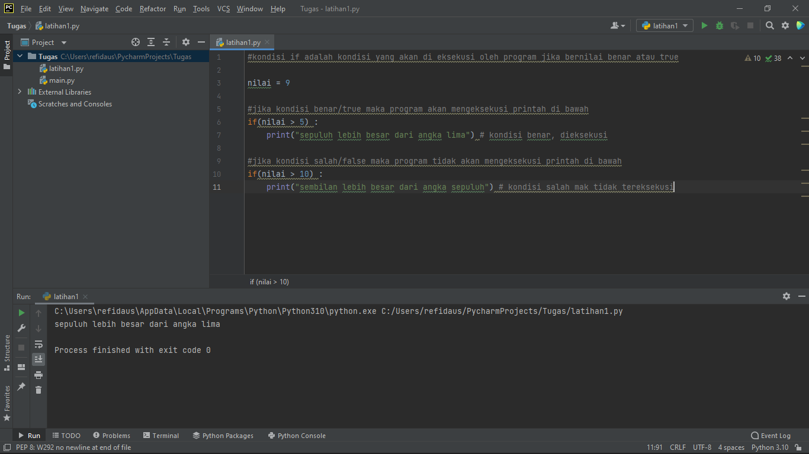
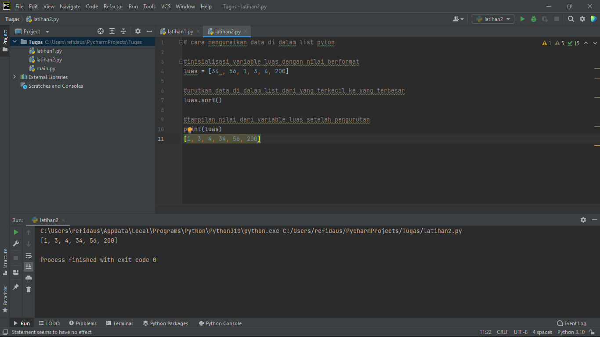
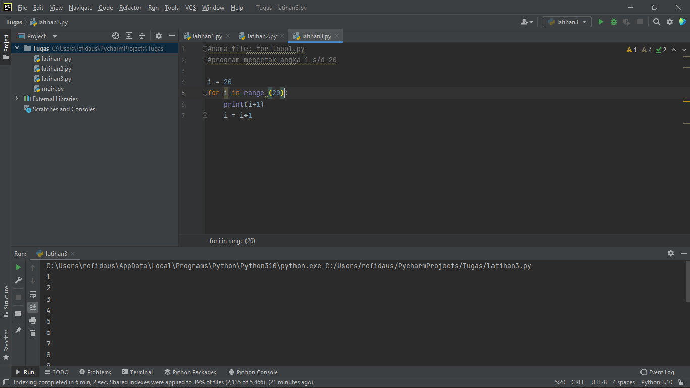
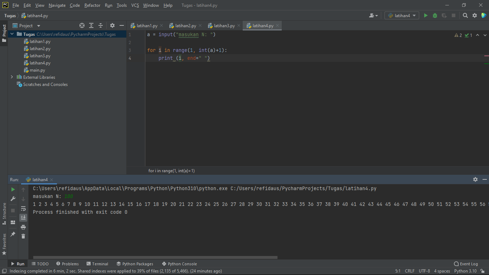

                                          LATIHAN MEMBUAT PROGRAM SEDERHANA
                                            LANGKAH LANGKAH MEMPROGRAMNYA
Menggunkan Aplikasi Pychram 

1. latihan1.py 

(BERIKUT CODINGANNYA) 

Lalu Klik Run 
 
 

Berikut hasil 

2. latihan2.py 

Lalu Membuat File Pyton Baru 

Tugas Kita Adalah Mengurutkan Data Yang Ada Pada Array List Variabel Luas Dari Urutan Acak Menjadi Urutan Dari Nilai Terkecil Ke Nilai Terbesar 

(BERIKUT CODINGANNYA) 

Lalu Klik Run 

 

Berikut hasil 

3. Latihan3.py 

                                            Nama FILE: FOR_;LOOP1.py 
                                         PROGRAM MENCETAK ANGKA DARI 1 s/d 10 
(BERIKUT CODINGANNYA) 

Lalu Klik Run 
 
 

Berikut hasil 

4. latihan4.py
(BERIKUT CODINGANNYA) 

Lalu Klik Run 
 
 

Berikut hasil 
